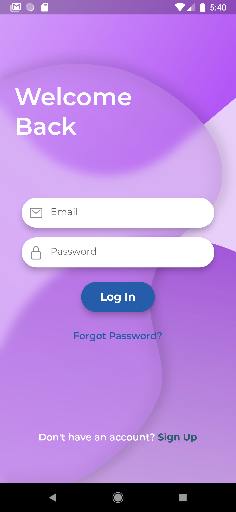
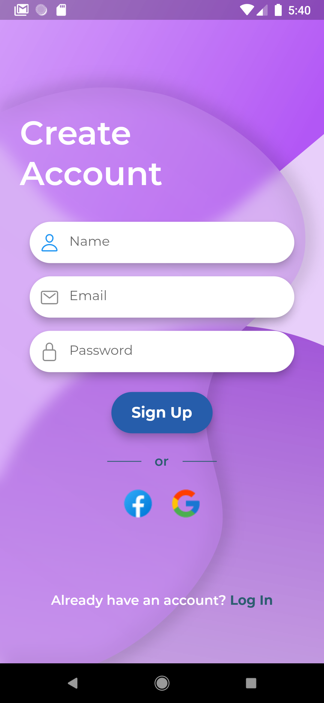
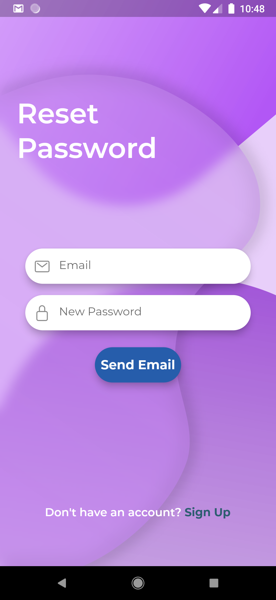

PEMROGRAMAN MOBILE

	UTS

	Dosen Pengampu : Muhammad Najamuddin Dwi Miharja, S.Kom, M.kom

 
	<b>Semester 6</b>

	

                 Nama  : Oktovan Agung Shailendra

                 NIM   : 312010131

                 Kelas : TI.20 A.1

 
 

	<b>UNIVERSITAS PELITA BANGSA</b>

	<b>FAKULTAS TEKNIK</b>

	<b>TEKNIK INFORMATIKA</b>

	<b>TA 2020/2021</b>

  

  

# LOGIN FORM MENGGUNAKAN FLUTTER

Projek ini berfokus pada desain UI Mobile Device. Disini saya menggunakan Visual Studio Code dan Android Studio.

Setelah menyiapkan alat dan prasyarat yang diperlukan untuk projek desain UI Mobile Device,dapat dilanjutkan dengan langkah-langkah berikut:

- Menyiapkan Flutter, langkah-langkah penginstalan yang dijelaskan dalam tutorial video ini:
'https:
//m.youtube.com/watch?v=UyUdXQuV1_I'. Ikuti semua petunjuk dalam video agar tidak ada kesalahan.

- Setelah menginstal Flutter, buka Visual Studio Code (VSCode) dan pastikan telah terinstall plugin yang diperlukan:
Widget Dart, Flutter, dan Flutter.

# Output
## Login Page

## Sign Up Page

## Reset Password Page
